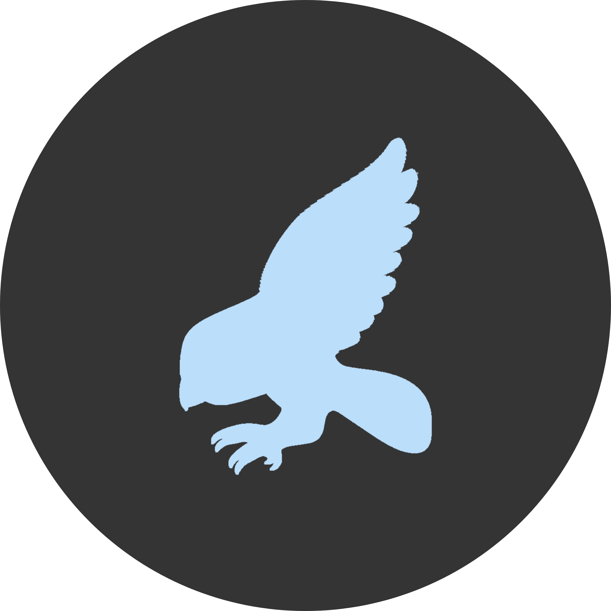

<b>Crowgram</b> 
Crowgram is a powerful, advanced, multi-featured Telegram userbot.

<h2>Deployment</h2>

You can use Crowgram through the cloud application platform Heroku.

<h2>Support</h2>

You can join us on any issue related to Crowgram Update and Support in Telegram.

